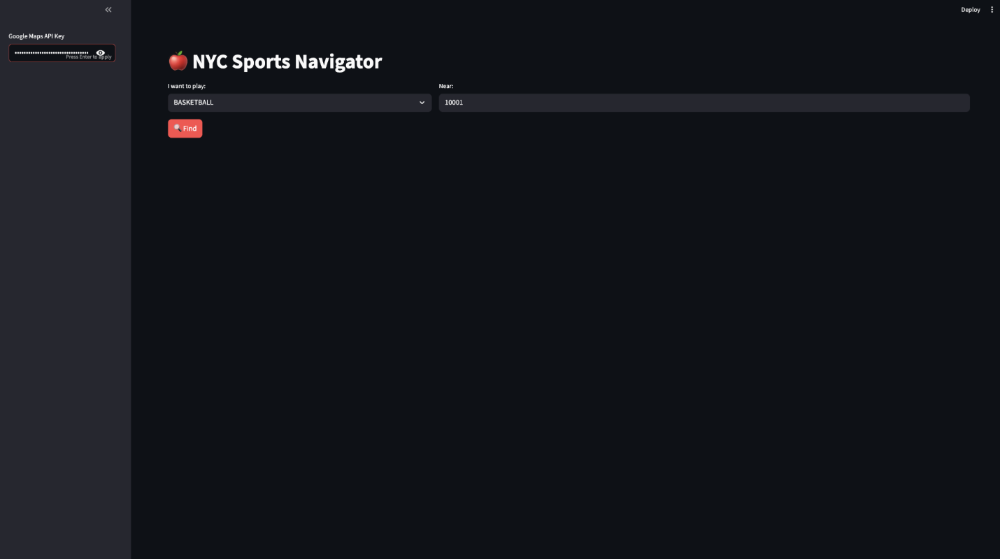
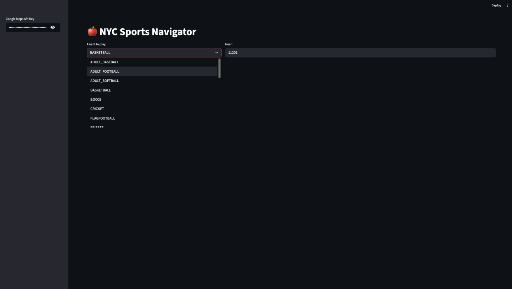
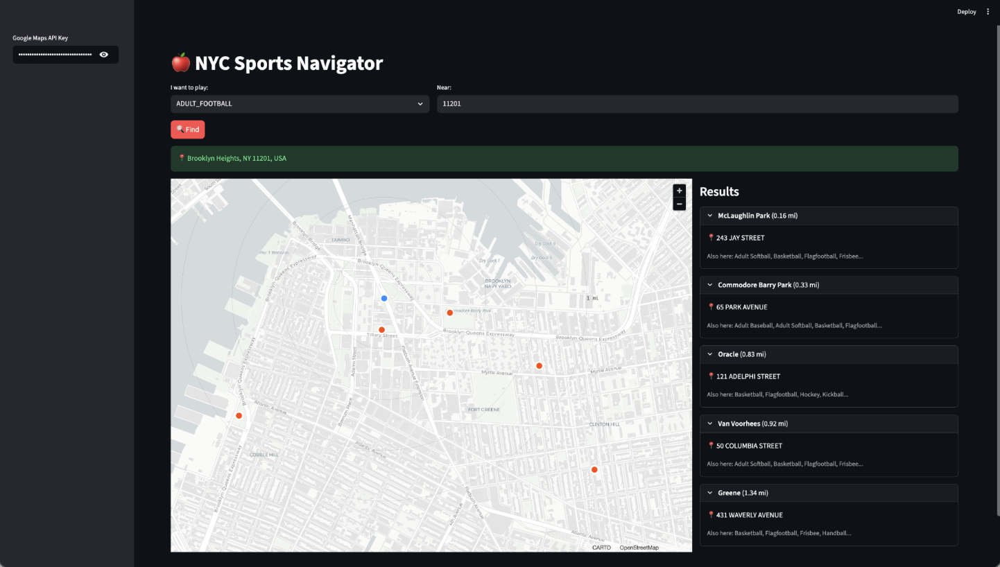

# 🗽 NYC Public Sports Facilities Navigator

**A Streamlit Dashboard for analyzing and locating public athletic facilities across the five boroughs of New York City.**


## 📖 Project Overview
This application allows users to explore New York City's public sports infrastructure interactively. It utilizes public data to analyze and locate sports facilities across New York City. When a user enters a location (address or zipcode) and a desired sport, the navigator finds the five nearest public facilities. 
This navigator was created based on my personal experiences after moving to NYC. It is designed to be useful for people searching for new hobbies, as well as for those who have recently relocated to New York, helping them easily find the sports facilities they're looking for. 

*This navigator was developed with the help of generative AI.*


**Key Features:**
* **Interactive Map:** Visualizes facility locations with filterable markers.
* **Borough Analysis:** Statistical breakdown of facilities per borough.
* **Facility Filtering:** Search by sport type (Tennis, Basketball, Soccer, etc.).

## 📸 Screenshots

### Home screen


### Search sports type and location


### Results with Map


## 📂 Project Structure
```text
NYC_Public_sports/
├── data/                  # Folder for dataset (CSV files)
├── notebooks/             # Jupyter notebooks for data cleaning & analysis
├── app.py                 # Main Streamlit application
├── requirements.txt       # Python dependencies
└── README.md              # Project documentation
```

## 🚀 Getting Started


1. Prerequisites
```text
Python 3.13
Git
```

2. Installation
```text
Clone the repository to your local machine:

Bash
git clone [https://github.com/ek4536/Project_1_NYC_Public_sports.git](https://github.com/ek4536/Project_1_NYC_Public_sports.git)
cd NYC_Public_sports
Install the required Python libraries:

Bash
pip install -r requirements.txt
```

3. Data Setup
```text
Note: The raw data files are excluded from this repository for size reasons.
Create a folder named data in the project root.

Download the "NYC Parks Athletic Facilities" dataset from NYC Open Data.
https://data.cityofnewyork.us/dataset/Athletic-Facilities/qnem-b8re/about_data
Rename the downloaded file to Athletic_Facilities.csv.

Download the "NYC Parks Athletic Facilities" dataset from NYC Open Data.
https://data.cityofnewyork.us/Recreation/Parks-Properties/enfh-gkve/about_data
Rename the downloaded file to Park_Properties.csv.

Place themn inside the data/ folder.
```

4. Running the App
```text
Launch the dashboard using Streamlit:

Bash
streamlit run app.py
```

## 📊 Data Source
Source: NYC Open Data
Dataset: Directory of Parks and Recreation Athletic Facilities

## 🛠️ Technologies Used
Python 3.13: Core programming language.
Pandas: For data manipulation and cleaning.
PyDeck / Mapbox: For geospatial mapping visualizations.
Streamlit: For building the interactive web interface.

## 👤 Author
Eunji Kim